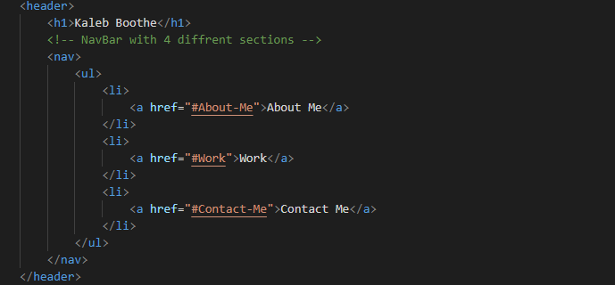
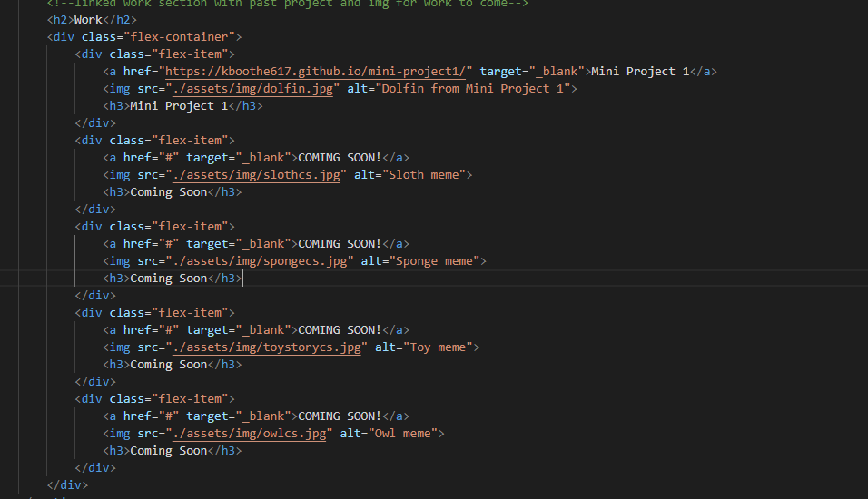
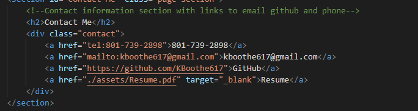

# module2-challenge

portfolio homework assignment 

## Overview

Starter personal portfolio showcasing projects and contact information.

## Features

Responsive Navagation Bar
Links to email, github, and past projects

## Technologies Used

HTML
CSS

## Future Updates

I will be adding future projects and fixing any bugs with images.

## Helpful Sources

[PDF Attachments](https://stackoverflow.com/questions/36899940/linking-to-a-pdf-file-with-html)
[Email Link](https://www.w3schools.com/tags/tryit.asp?filename=tryhtml_link_mailto)
[Phone Link](https://www.w3schools.com/tags/tryit.asp?filename=tryhtml_link_phoneto)